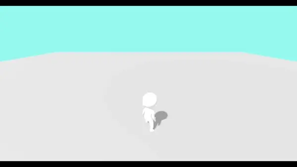
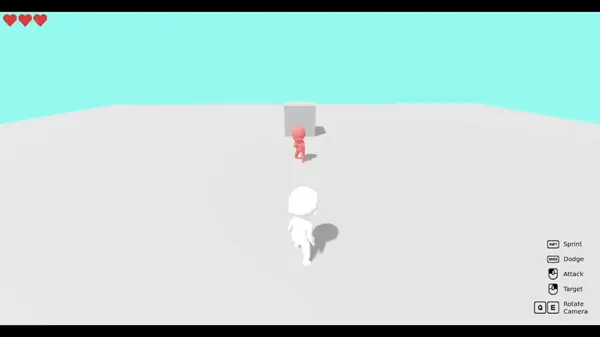
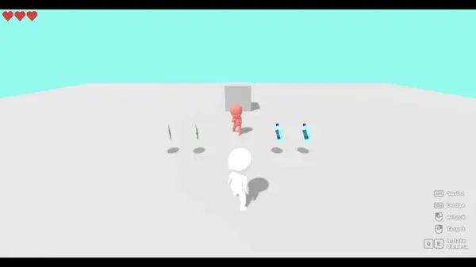
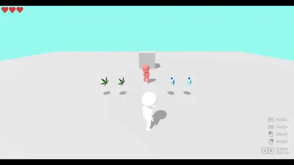
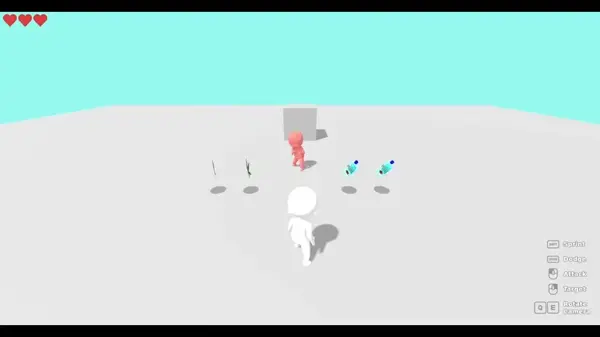

## 🐸🫙 Frog Jam Template

> [!IMPORTANT]
> You can use any engine and make the game in any way you'd like (2d/3d, doesn't matter). This is a resource for those that are unfamiliar with game-dev and want something to mess around with.

### Using this Template:
1. Download the Godot Engine (latest) from [here](https://godotengine.org/download) and extract it.
2. Download the files of this repository either via the green button at the top right or with git software like [Github Desktop](https://github.com/apps/desktop).
3. Launch the extracted Godot Engine app and import the `project.godot` file into it.

### Template Features:

> [!Note]
> You can view the imgur album, which has sound, [here](https://imgur.com/a/frog-jam-development-progress-QlAxQKb).

Basic Character Movement (Walk, Run, Dodge Roll)

Enemy Targeting

Jump Attack / Back-flip

Input Key Hints

Health Display (4 piece, Heart Container akin to Zelda)

Item Pickups

Circular Quick-Menu/Inventory

New UI/Pickup sounds

Inventory Item Rotation

Inventory Item Name/Description (using Lang file)

Inventory Open/Close Animation

Inventory Input Hints

Consume Action, with Visuals, Sounds, and Particles

Animation Tree- Separation of Upper and Lower Body in Animations

> [!TIP]
> Need help? Join our [DevFrogs discord](https://discord.gg/2aVq8qmcSr).